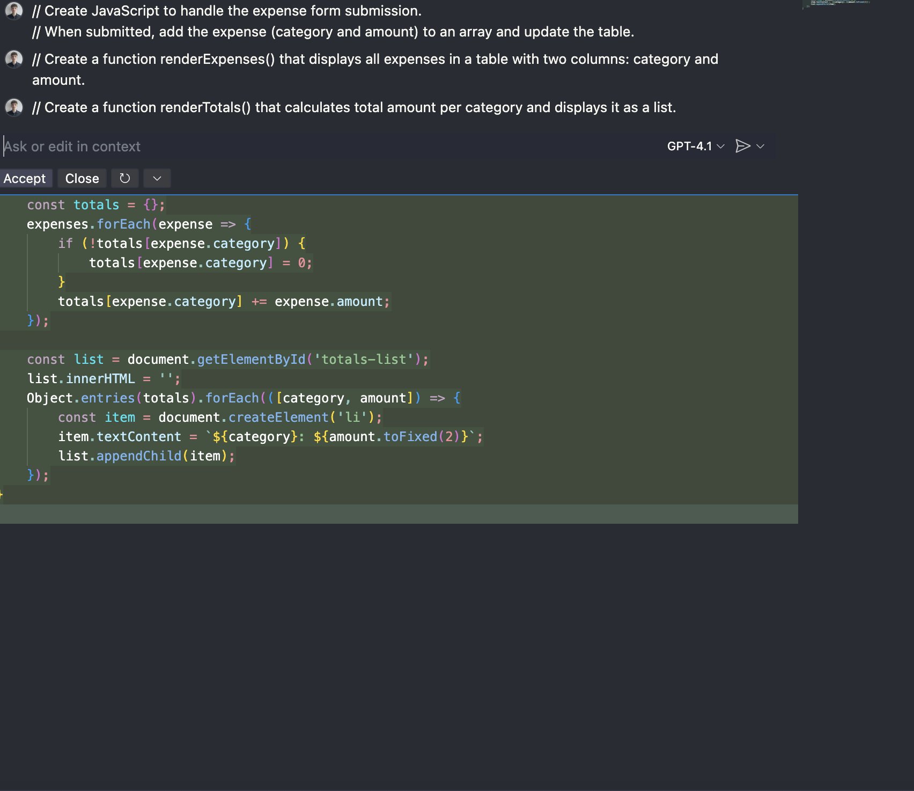
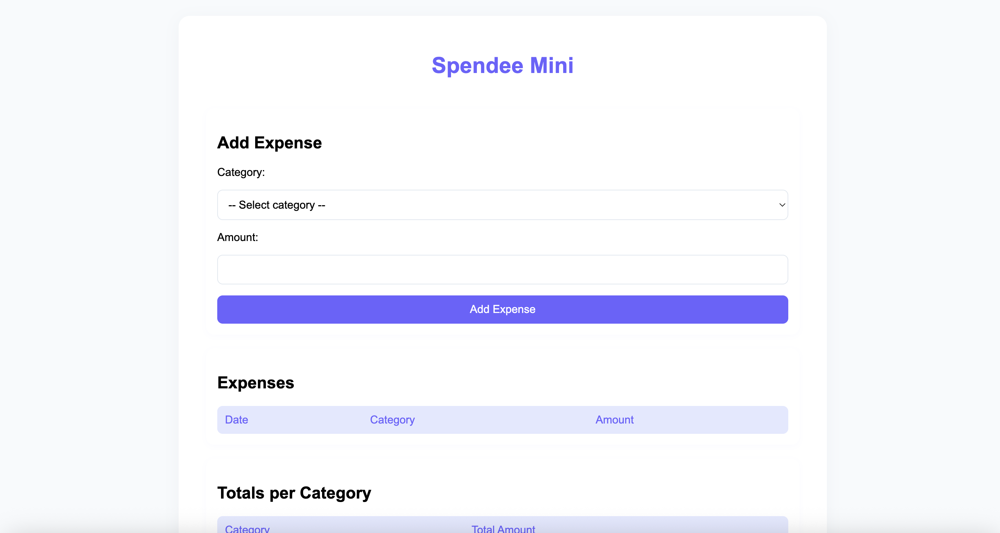

# Spendee Mini - Budget Tracker

## 1. Title
Spendee Mini - Budget Tracker

## 2. Description
Spendee Mini is a simple budget tracking application inspired by the Spendee app.  
The purpose of this project is to help users manage their budget by collecting expenses in specific categories and calculating totals per category.  
The application allows the user to select a category, input the expense amount, and automatically updates both the expenses table and the category totals.  

## 3. Technologies Used
- **HTML5** – page structure  
- **CSS3** – styling and layout  
- **JavaScript** – interactivity and data handling  

## 4. How to Run
1. Clone this repository:  
   ```bash
   git clone https://github.com/oskarkrzyzak/spendee_mini.git

## 5. Features
- Add new expenses with category and amount  
- Display all expenses in a table with date, category, and amount  
- Calculate totals automatically for each category  
- Validate inputs to prevent empty categories or invalid numbers  
- User-friendly interface with a clean and modern design  

## 6. Example Screenshots
Below are screenshots showing the application and parts of the development process:

  
  
  
  
  
  
  

## 7. Project Structure
spendee_mini/
├── index.html        # Main HTML file
├── styles.css        # Styling
├── script.js         # JavaScript functionality
├── README.md         # Project documentation
├── REFLECTION.md     # Reflection answers
└── images/           # Screenshots (ss1.png … ss7.png)