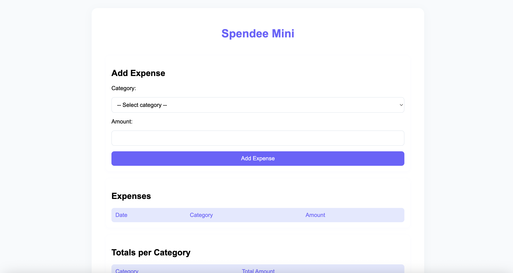
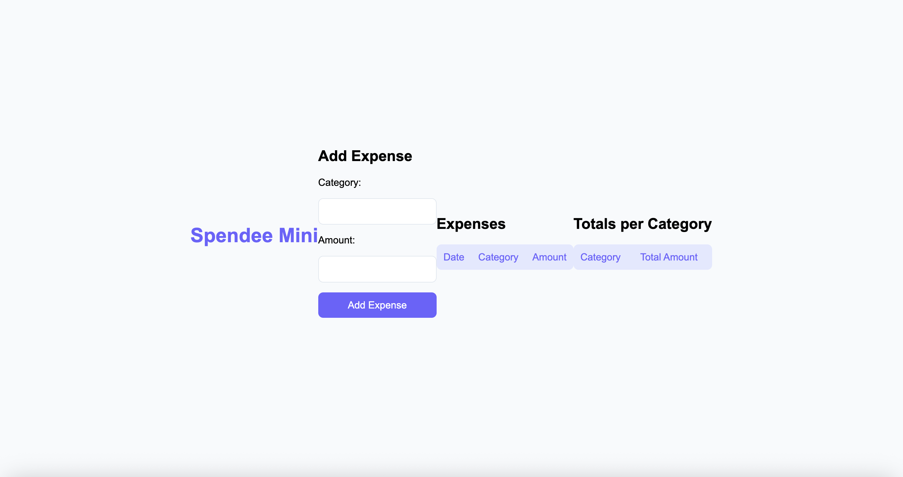
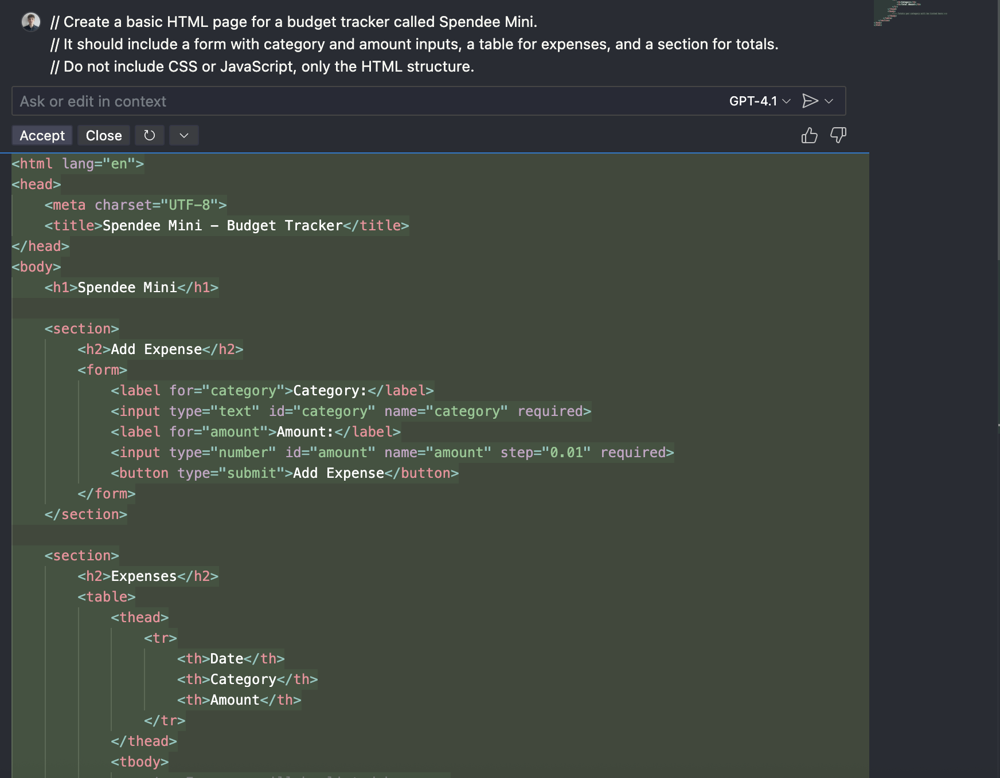
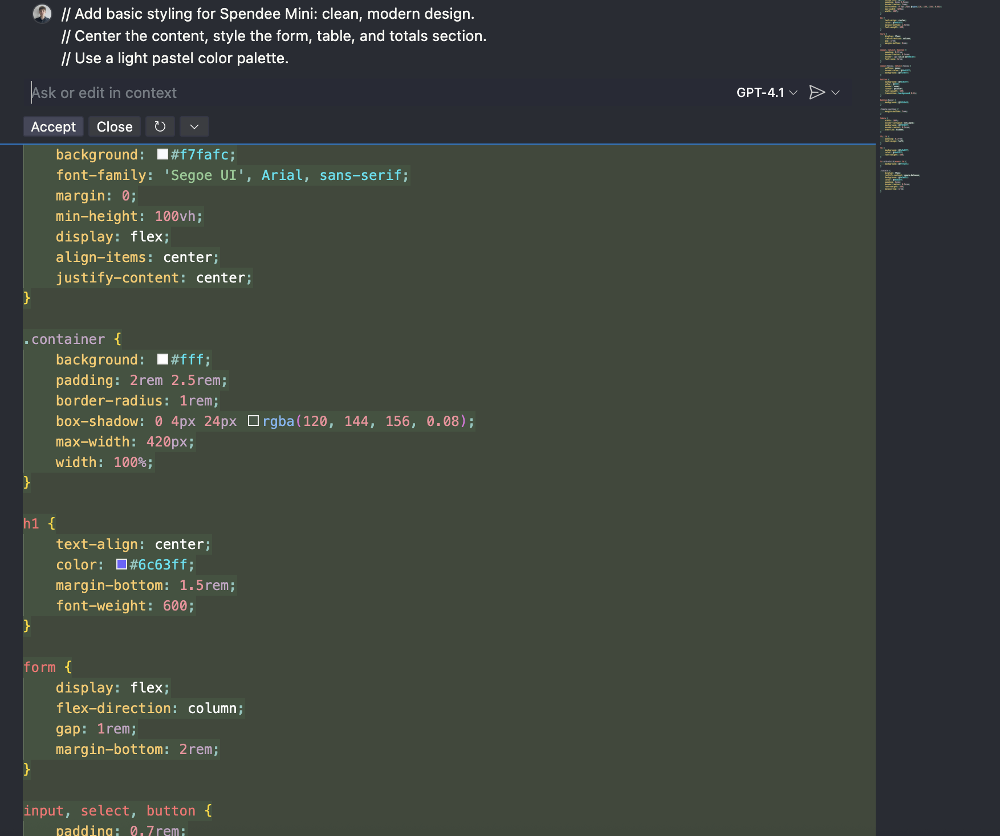
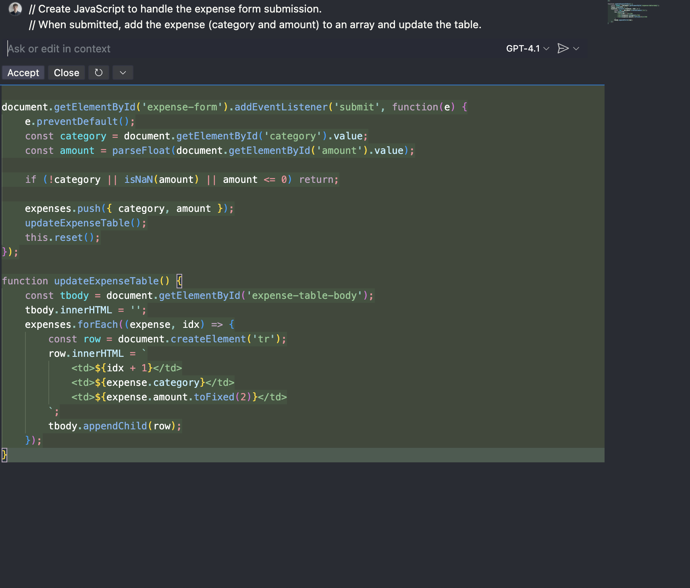
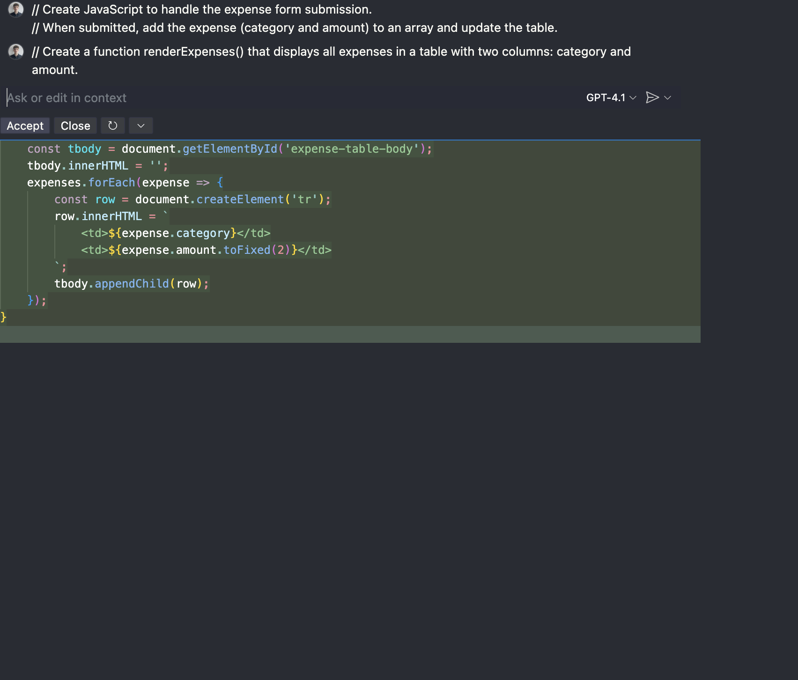
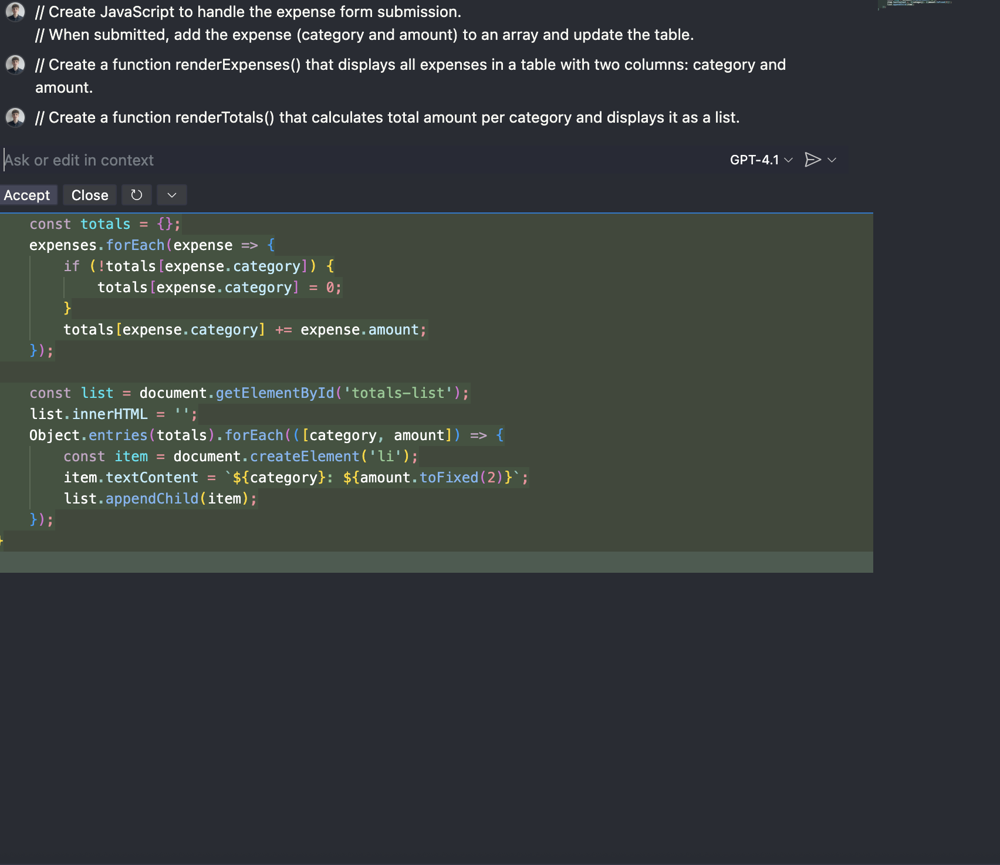

# Reflection on Using GitHub Copilot

## 1. What did you ask Copilot to help you build? How did you break down the problem?
For this assignment, I asked GitHub Copilot to help me create a simple budget tracking application called Spendee Mini.  
The process started with broad prompts such as:  

- "Create a basic HTML page for a simple budget tracker called Spendee Mini. It should allow a user to add expenses with categories and amounts. Display a table with all expenses and a total per category."  

From there, the problem was broken down into smaller steps and prompts. Instead of building everything at once, I guided Copilot feature by feature:
- First, the form for adding expenses 
- Then, the list of expenses with a table layout  
- Next, the logic for totals per category
- Finally, improvements such as form validation and dropdown category selection

This approach allowed me to stay in control of the design while Copilot generated the code that matched each specific request.

---

## 2. How did your approach to asking questions change as you worked?
At the beginning, my prompts were more general, but as I progressed, I realized that I needed to explain my vision as if I were talking to someone who had no prior knowledge of my thoughts.  
I began writing prompts in a way that included all the most important details of what I wanted. For example, instead of asking Copilot to “add a category”, I described clearly that the category should be chosen from a dropdown list rather than typed manually.  

This shift toward detailed, explicit prompts resulted in better, more accurate code suggestions.

---

## 3. What parts of the development process with GitHub Copilot surprised you?
The most surprising part was how Copilot handled changes that required edits across multiple files.  
For example, when I asked Copilot to change the category input from text to a dropdown menu, it automatically updated not just the HTML form, but also made the corresponding changes in the JavaScript logic so that everything worked together seamlessly.  
I expected to have to update each file manually, but Copilot synchronized these updates across the project.

Screenshots: 
  
  

---

## 4. What did you learn about the technology you used that you didn't know before?
While working on this project, I learned more about structuring a web application into separate files (HTML, CSS, JavaScript).  
In the past, I often kept everything inside one file, but through this assignment, I saw how clean and maintainable it is to separate:
- HTML for structure  
- CSS for design and styling  
- JavaScript for logic and interactivity  

This made it easier to understand how each part contributes to the project and how to modify one piece without breaking everything else.

---

## 5. What would you do differently if you had to build this again?
If I were to build this again, I would start by writing a more general outline of the entire application first.  
I would describe all the main features upfront (adding expenses, displaying expenses, calculating totals, and validation), almost like listing the “methods” of the application.  
Then, I would go back and describe each feature in detail one by one. This would make the development process even more structured and efficient.

---

## Additional Screenshots of Copilot Interactions
Here are some other screenshots showing my interactions with Copilot during the project:

  
  
  
  
  